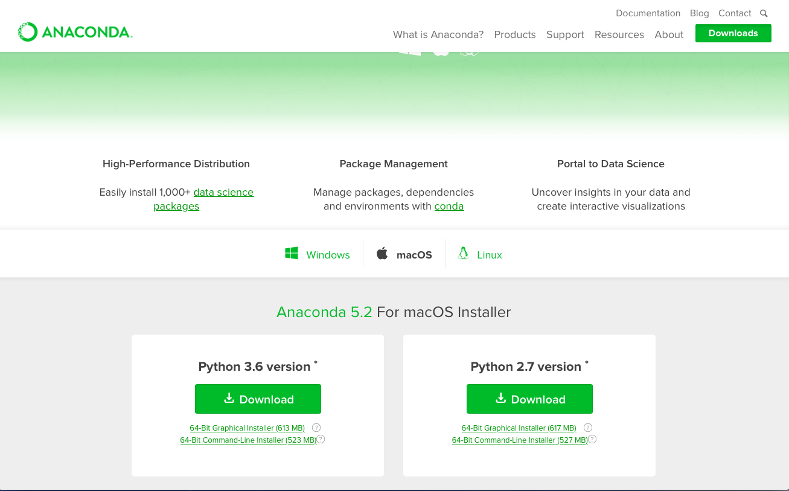
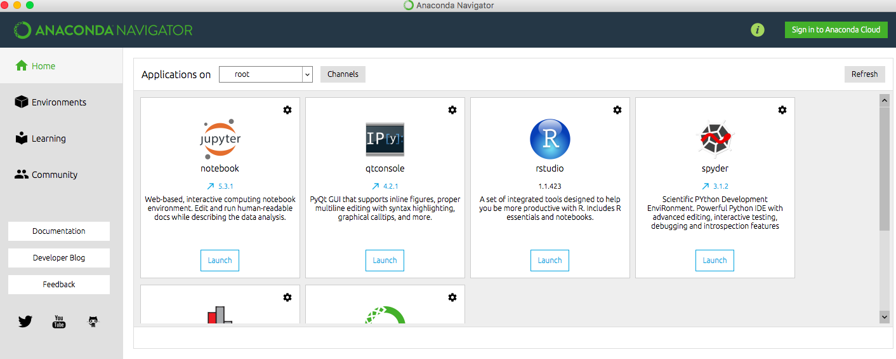
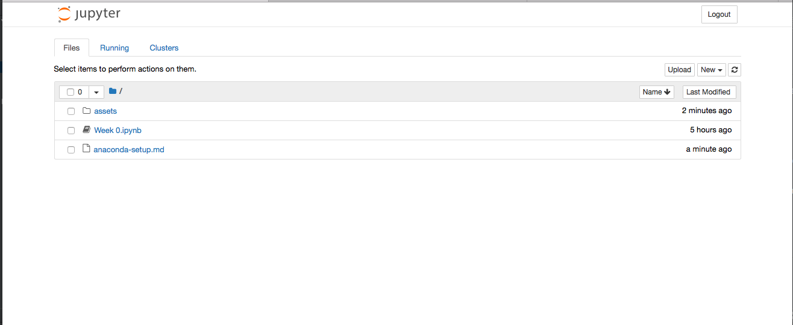
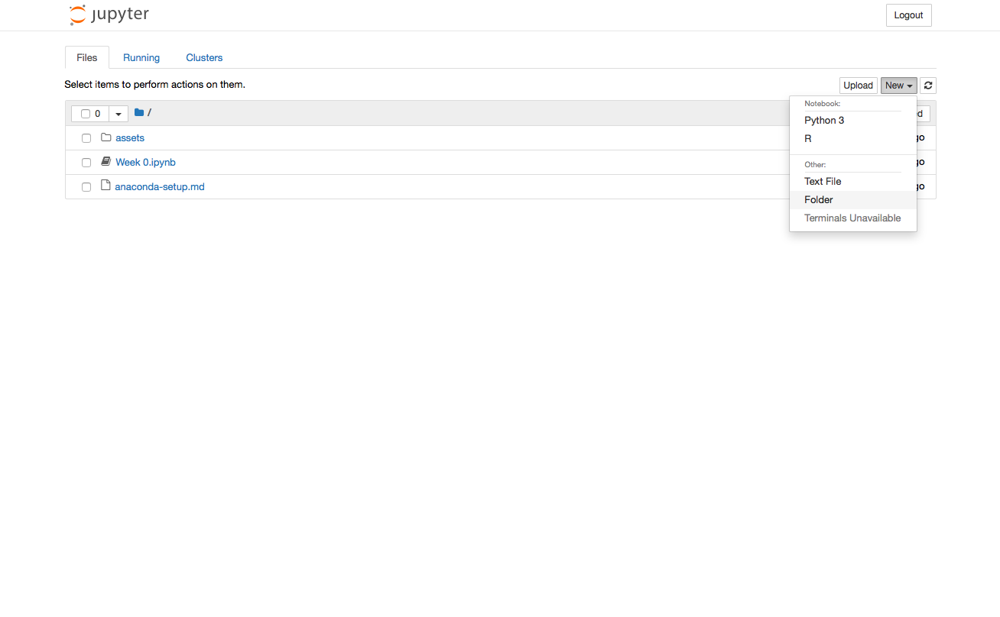

## Setting up Anaconda

The Anaconda Distribution is a set of useful packages, libraries and code editors
that make it easy to write code that can be shared alongside explanations.

These classes shall use Jupyter Notebooks extensively towards the end, however it would be 
a good idea to start using it now and get familiar with it. Not only would this ease the learning
curve, it would also allow you to run the notebooks we prepare to illustrate the concepts covered by a 
particular class. 

## Downloading

Anaconda can be downloaded from [here](https://www.anaconda.com/download). Download the version suited for the operating
system you are running (Windows, Mac, Linux). **Download the Python 3.6 Version**.

## Running it

Once it's installed on your machine, to open it, find **Anaconda-navigator** in the taskbar (windows users) or search for it in spotlight 
(mac users). 

Once it opens, you should see something similar to the image below. 

Click on the launch button underneath jupyter notebook.

## Creating a notebook

Once jupyter is launched, you should see a screen looking similar to the one below (the files would be different on your computer).

If you haven't already created a folder for the classes, go ahead and create one now by clicking on **New** in the top right hand
corner and then selecting **Folder** amongst the **Other** options.

Once you have named and created a new folder, go ahead and click on it to enter it. Now you are ready to create a new jupyter notebook. 
To create a new notebook, click on the same **New** button as earlier and this time select Python 3 from Notebooks. 
This shall create a new notebook where you can write code and document it alongside.

## Running an existing notebook

Launch jupyter as outlined above and go to the folder where the notebook is located within Jupyter. Once you find
the notebook, click on it and it should open in a new tab. Now you can select a cell and hit Shift+Enter to execute it.

## Further Reading

To learn more about what else you can do with Jupyter Notebooks, read this link [here](https://www.datacamp.com/community/tutorials/tutorial-jupyter-notebook)

